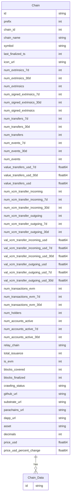

## Data Model

```mermaid
erDiagram
    Chain ||--o{ Chain_Data : has
    Chain {
        id string
        prefix int
        chain_id int
        chain_name string
        symbol string
        last_finalized_ts int
        icon_url string
        num_extrinsics_7d int
        num_extrinsics_30d int
        num_extrinsics int
        num_signed_extrinsics_7d int
        num_signed_extrinsics_30d int
        num_signed_extrinsics int
        num_transfers_7d int
        num_transfers_30d int
        num_transfers int
        num_events_7d int
        num_events_30d int
        num_events int
        value_transfers_usd_7d float64
        value_transfers_usd_30d float64
        value_transfers_usd float64
        num_xcm_transfer_incoming int
        num_xcm_transfer_incoming_7d int
        num_xcm_transfer_incoming_30d int
        num_xcm_transfer_outgoing int
        num_xcm_transfer_outgoing_7d int
        num_xcm_transfer_outgoing_30d int
        val_xcm_transfer_incoming_usd float64
        val_xcm_transfer_incoming_usd_7d float64
        val_xcm_transfer_incoming_usd_30d float64
        val_xcm_transfer_outgoing_usd float64
        val_xcm_transfer_outgoing_usd_7d float64
        val_xcm_transfer_outgoing_usd_30d float64
        num_transactions_evm int
        num_transactions_evm_7d int
        num_transactions_evm_30d int
        num_holders int
        num_accounts_active int
        num_accounts_active_7d int
        num_accounts_active_30d int
        relay_chain string
        total_issuance int
        is_evm int
        blocks_covered int
        blocks_finalized int
        crawling_status string
        github_url string
        substrate_url string
        parachains_url string
        dapp_url string
        asset string
        decimals int
        price_usd float64
        price_usd_percent_change float64
    }
    Chain_Data {
        id string
    }

```