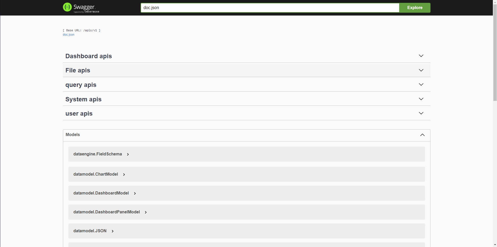

## What is Hyperdot
Hyperdot is a blockchain analytics platform that allows access to and consumption of on-chain data. It can be thought of as the GitHub of the blockchain world, with its core focus on data analysis and visualization. With the help of this tool, Hyperdot users can view and exchange data from various sources, including Polkadot, Kusama, Moonbeam, Acala, HydraDX, Astar, Hashed, and hundreds of other parallel chains.

## What is Hyperdot-node

Hyperdot-node is a part of the Hyperdot project. It integrates the public data warehouse for Polkadot using Google BigQuery provided by [substrate-etl](https://github.com/colorfulnotion/substrate-etl). Hyperdot-node serves as the API provider for Hyperdot and orchestrates the underlying infrastructure.

Hyperdot-node can:

- Provide the necessary API for Hyperdot's frontend.
- Handle the orchestration and management of the foundational infrastructure, including databases, caching, and object storage.
- Integrate the Google BigQuery public data warehouse for Polkadot using substrate-etl.
- Allow querying and chart creation through SQL.
- Enable sharing of charts and dashboards.

The components of Hyperdot-node are illustrated in the diagram below:


## Installation

There are two options for installing and running the Hyperdot-node server:
1. [Docker Installation Guide](#docker-installation-guide)
2. [Source Code Installation Guide](#source-code-installation-guide)

## Prerequisites

To quickly get Hyperdot-node up and running, you need to prepare the following:

1. Make sure you have Docker installed.
2. Ensure that you have Docker Compose for orchestration.
3. You'll need a Google BigQuery account.
4. You'll need an [API key from polkaholic](https://polkaholic.io/) at [polkaholic](https://polkaholic.io/login).

### Prepare Google Application Default Credentials

Hyperdot-node requires querying data from Google BigQuery, so when running Hyperdot locally, you need to set up Google Application Default Credentials. You can refer to [Setting up Application Default Credentials](https://cloud.google.com/docs/authentication/provide-credentials-adc) for more information.

After preparing Google Application Credentials, follow these steps to get ready:

1. Create a new project, or you can use an existing one.
2. Assign permissions to the account to ensure access to BigQuery.
3. Go to the [Service Accounts](https://console.cloud.google.com/iam-admin/serviceaccounts) page in the Google Console to create or use the application credentials.
4. Obtain the application credentials, place them in the project's root directory in the `config` folder, and rename them to `hyperdot-gcloud-iam.json`.

## Docker Installation Guide

Running the application using Docker allows for minimal setup and quick deployment. It is recommended for evaluation purposes, such as local development.

1. Clone the project to your local machine:
   ```shell
   git clone https://github.com/Infra3-Network/hyperdot-node.git
   ```

2. Copy `config/hyperdot-sample.json` to `config/hyperdot.json`.

3. Rename the application credentials file you obtained in preparation step 4 to `hyperdot-gcloud-iam.json` and copy it to the `config` directory.

4. Modify the configuration in `config/hyperdot.json`. For example, if you used the project 'foo' in preparation step 1, adjust the configuration as follows:
   ```json
   {
      "bigquery": {
        "projectId": "foo"
      }
   }
   ```

5. Build the Docker image:
   ```shell
   make build/docker
   ```
   If you are using macOS with an M1/2/3 chip, you can build an ARM image with:
   ```shell
   make build/docker-arm
   ```

6. Modify the infrastructure layer container configuration (you can skip this if you don't need to make changes). You can enable local data persistence by adjusting the infrastructure layer's image configuration:
   ```shell
   cp orchestration/docker-compose/.env-sample orchestration/docker-compose/.env
   ```
   You can modify the contents of the `.env` file, such as the persistence path for the infrastructure layer container.

7. Start, stop, or remove the containers with the following commands:
   ```shell
   # Start
   make up

   # Stop
   make stop

   # Remove
   make rm
   ```

8. Now, the hyperdot-node service should be running. Try accessing http://localhost:3030/apis/v1/swagger/index.html to explore!


## Source Code Installation Guide

To install in source code mode, you will need the following:

- Docker Engine
- Makefile toolchain
- Unix-based operating system
- Go 1.20
- Postgres
- Redis
- Minio

Follow the steps below to quickly run the hyperdot-node server:

1. Compile the Go source code:

   ```shell
   go mod tidy && go mod vendor

   go build -o /path/to/hyperdot-node cmd/node/main.go
   ```

   If you want to disable CGO, you can do the following:

   ```shell
   CGO_ENABLED=0 GOOS=linux go mod tidy
   CGO_ENABLED=0 GOOS=linux go mod vendor
   CGO_ENABLED=0 GOOS=linux go build -o /path/to/hyperdot-node cmd/node/main.go
   ```

2. To run hyperdot-node, you need to configure it to integrate with the foundational system. Refer to the [Configuration](#configuration) section for instructions on how to make these changes.

3. You need to set up Google application credentials. For Linux/MacOS users, you can do this with the following command:

   ```shell
   export GOOGLE_APPLICATION_CREDENTIALS="KEY_PATH"
   ```

   Replace `"KEY_PATH"` with the actual path to your Google application credentials file.
4. Run the program by executing the compiled Golang program:

   ```shell
   /path/to/hyperdot-node -config=/path/to/hyperdot.json
   ```

5. Try accessing [http://localhost:3030/apis/v1/swagger/index.html](http://localhost:3030/apis/v1/swagger/index.html) to explore it!

## Advance Configuration

We provide a sample configuration file `config/hyperdot-sample.json` that you can use as a reference for making modifications:

```json
{
    "polkaholic": {
        "apiKey": "<YOUR API_KEY>",
        "baseUrl": "https://api.polkaholic.io"
    },
    "apiserver": {
        "addr": ":3030"
    },
    "bigquery": {
        "projectId": "hyperdot"
    },
    "localStore": {
        "bolt": {
            "path": "hyperdot.db"
        }
    },
    "postgres": {
        "host": "postgres",
        "port": 5432,
        "user": "hyperdot",
        "password": "hyperdot",
        "db": "hyperdot",
        "tz": "Asia/ShangHai"
    },
    "s3": {
        "endpoint": "minio:9000",
        "useSSL": false,
        "accessKey": "hyperdot",
        "secretKey": "hyperdot"
    },
    "redis": {
        "addr": "redis:6379"
    }
}
```

- `polkaholic`
  - `apiKey`: We obtain chain configuration information from [polkaholic.io](https://polkaholic.io/), so you need to replace it with your own API key.
  - `baseUrl`: Typically, you do not need to modify this configuration.

- `apiserver`
  - `addr`: Hyperdot runs by default on port 3030, but you can modify this configuration if needed.

- `bigquery`
  - `projectId`: You need to configure the `projectId` to query BigQuery. You can refer to the [Prerequisites](#prerequisites) section for details.

- `localStore`
  - `bolt`
    - `path`: We use the `bolt` database to store some data and metadata. If necessary, you can modify the storage path.

- `postgres`: We use PostgreSQL to store user data. If needed, you can modify the PostgreSQL configuration.

- `s3`: We use Minio object storage by default to store user blob data. If needed, you can also use other object storage that is compatible with the S3 protocol.

- `redis`: We use Redis to cache on-chain and user data. If needed, you can also modify the Redis configuration.

## Testing

This will guide you through the steps to test various aspects of the publisher node.

### Start the Test Environment

```shell
make up-test
# docker-compose -f tests/docker-compose.yaml up -d
# Creating network "hyperdot-node-test_default" with the default driver
# Creating hyperdot-test-postgres ... done
# Creating hyperdot-test-redis    ... done
# Creating hyperdot-test-minio    ... done
```

### Run Tests

Before running tests, you will need to configure Google Application Credentials and the Polkaholic API key. If you have completed the configuration, you can run the tests using the following command. Otherwise, you can refer to the [Prerequisites](#prerequisites) section on how to configure them.

After creating the credentials, you need to modify the configuration file:

```shell
cp tests/hyperdot-sample.test.json  tests/hyperdot.test.json
```

Modify the `tests/hyperdot.test.json` configuration by updating the `apiKey` and `projectId` in the `polkaholic` and `bigquery` sections:

```json
{
    "polkaholic": {
        "apiKey": "<YOUR_API_KEY>",
        "baseUrl": "https://api.polkaholic.io"
    },

    "bigquery": {
        "projectId": "<YOUR_PROJECT_ID>"
    },
}
```

Then, run the tests with the following command:

```shell
# Ensure dependencies installed
go mod tidy 

go mod vendor

make tests
```

### Run Lint

If you want to run lint to check your code, you will need to:

- Install golangci-lint. You can refer to [Install](https://golangci-lint.run/usage/install/).

```shell
make lint
```

## API Reference

We have generated OpenAPI documentation for all internal APIs. You can import `docs/swagger.[json|yaml]` into a Swagger-compatible online viewing service. You can also access it by running Hyperdot-node and visiting `/apis/v1/swagger/index.html`.



## Troubleshooting

1. For users in China, if you encounter timeout issues while compiling the program, you can try configuring a Go proxy, such as https://goproxy.io/zh/.

2. For users in China, if you encounter TLS timeout issues when running the Hyperdot-node image or the pre-compiled program when accessing Google BigQuery, you can configure a proxy:

   ```shell
   # For Docker image, add the following to ~/.docker/config.json, then restart Docker
   {
    "proxies":
        {
        "default":
            {
                "httpProxy": "http://proxy.example.com:8080",
                "httpsProxy": "http://proxy.example.com:8080",
                "noProxy": "localhost,127.0.0.1,.example.com"
            }
        }
    }

   # For pre-compiled programs, you can set the dialing in the terminal
   export http_proxy=<your proxy>
   export https_proxy=<your proxy>
   ```

## License

Please refer to the [LICENSE](../LICENSE).